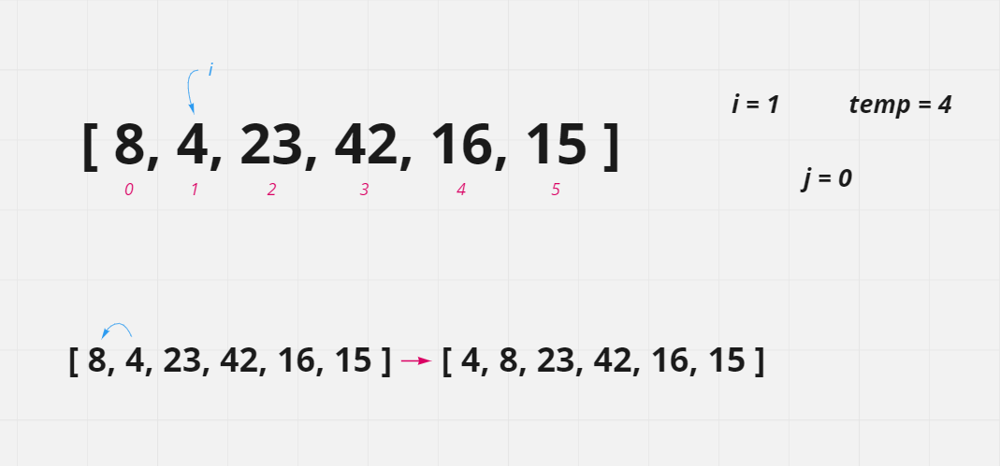
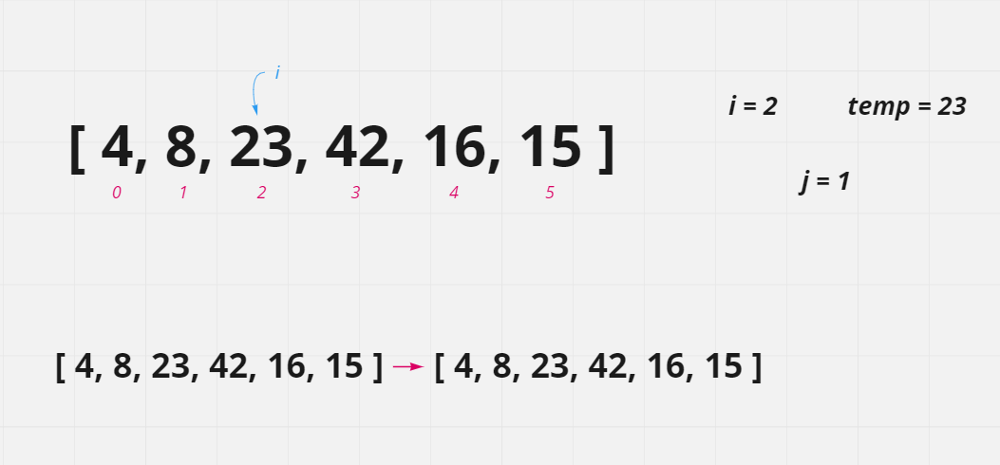
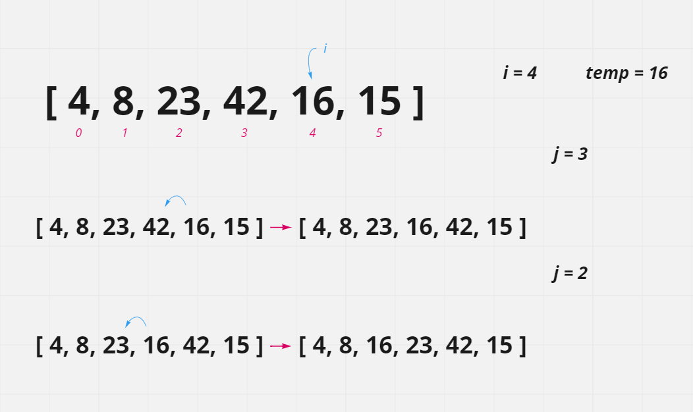
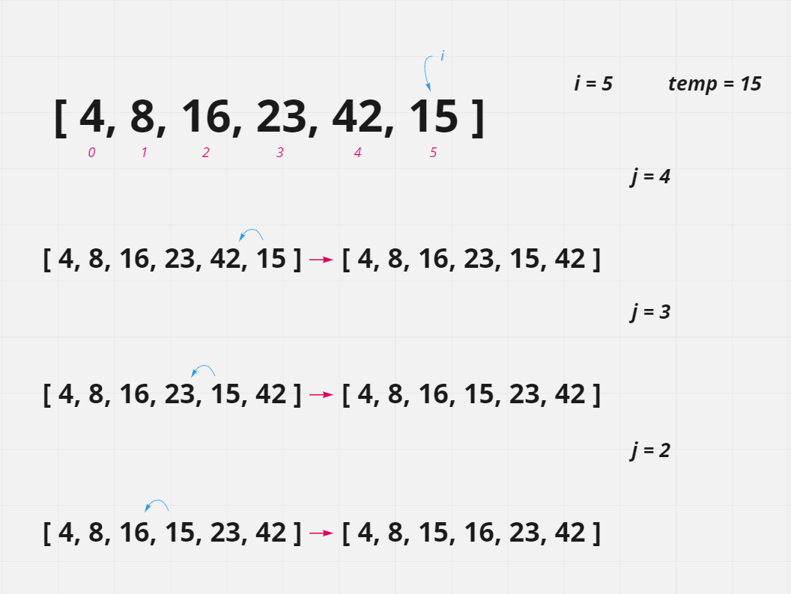

# Insertion Sort

Insertion sort is an array sorting algorithm which splits the original array into *'sorted'* and *'unsorted'* parts. As each element/value of the unsorted part of the array is encountered, it is placed at the correct position in the sorted part of the array. This process is repeated until all of the values in the unsorted part have been placed in order in the sorted part, which becomes the sorted array.

The array is traversed with a for loop which starts at index 1 and using a while loop checks the value at the current index *(temp)* against the the value of the preceding index. If the *temp* value is less that that of the previous index, the two values are switched. If the value of *temp* is equal or higher than the value of the preceding index, no values are changed and the for loop continues on.

If a transposition of values occurs, the same comparison is carried out for the index where the *temp* value now resides and the value of the index now preceding it (if one exists). If the value of *temp* is less, the values of the two indexes are switched.

This process continues until either the value of *temp* is no longer less than the value of the preceding index, or until there is no longer a preceding index (the beginning of the array is reached), at which point *temp* would become the first value in the array.

## Pseudocode

```
InsertionSort(int[] arr)

  FOR i = 1 to arr.length

    int j <-- i - 1
    int temp <-- arr[i]

    WHILE j >= 0 AND temp < arr[j]
      arr[j+1] <-- arr[j]
      j <-- j - 1

    arr[j+1] <-- temp
```

## Trace

#### Sample Array: [8, 4, 23, 42, 16, 15]



During the first pass of the insertion sort, the *temp* value of 4 is compared to value 8. Because it is lower in value and `j` is >= 0, the value of 8 is assigned to index 1 *(0 + 1)*. Then the value of `j` is decremented by 1. Because the value of `j` is now -1, the while loop ends and the value of 4 is assigned to index 0 *(-1 + 1)*.



In the next pass, the *temp* value is 23. When 23 is compared to the preceding index value of 8, it is not lower and, therefore, the while loop does not start. The value of 23 is reassigned to its original position since it was index 2 and `j` is currently 1. Ergo, 23 is assigned to index 2 *(1 + 1)*.


Similarly, in the third pass, the *temp* value is 42. Again, 42 is compared to the preceding value of 23, it is not lower and, therefore, the while loop does not start. The value of 42 is reassigned to its original position since it was index 3 and `j` is currently 2. 42 is assigned to index 3 *(2 + 1)*.



In the fourth pass, the *temp* value is 16. 16 is compared to 42, the preceding index value, and because it is lower, the value of 42 is assigned to index 4 *(3 + 1)* and `j` decrements from 3 to 2. The while loop runs again because `j` is still >= to 0 and 16 is now less than the value at index 2, which is 23. 23 is assigned to index 3 *(2 + 1)* and `j` is decremented again to 1. While `j` is still >= 0, the *temp* value of 16 is not less than the value at index 1, which is 8. So the while loop finishes and the value of 16 is assigned to index 2 *(1 + 1)*.



Finally, in the fifth and last pass, the *temp* value becomes 15. 15 is compared to 42 at index 4, and because it is lower, the value of 42 is assigned to index 5 *(4 + 1)* and `j` decrements from 4 to 3. The while loop runs again because `j` is still >= to 0 and 15 is less than 23, the value at index 3. 23 is assigned to index 4 *(3 + 1)* and `j` is decremented again to 2. The value at index 2 is 16 which is larger than 15. So the value of 16 is assigned to index 3 *(2 + 1)* and `j` decrements to 1. While `j` is still >= 0, the *temp* value of 15 is greater than the value at index 1, which is 8. So the while loop finishes and the value of 15 is assigned to index 2 *(1 + 1)*.

The for loop ends and the array has been sorted:

- **[ 4, 8, 15, 16, 23, 42 ]**

## The Code

The complete code for this sort function looks like:

```JavaScript
const insertionSort = (arr) => {
  for(let i = 1 ; i < arr.length ; i++) {
    let j = i-1;
    let temp = arr[i];

    while( j >= 0 && temp < arr[j]) {
      arr[j+1] = arr[j];
      j--;
    }

    arr[j+1] = temp;
  }
  return arr;
};
```

and it can be found [here](./insertion-sort.js)