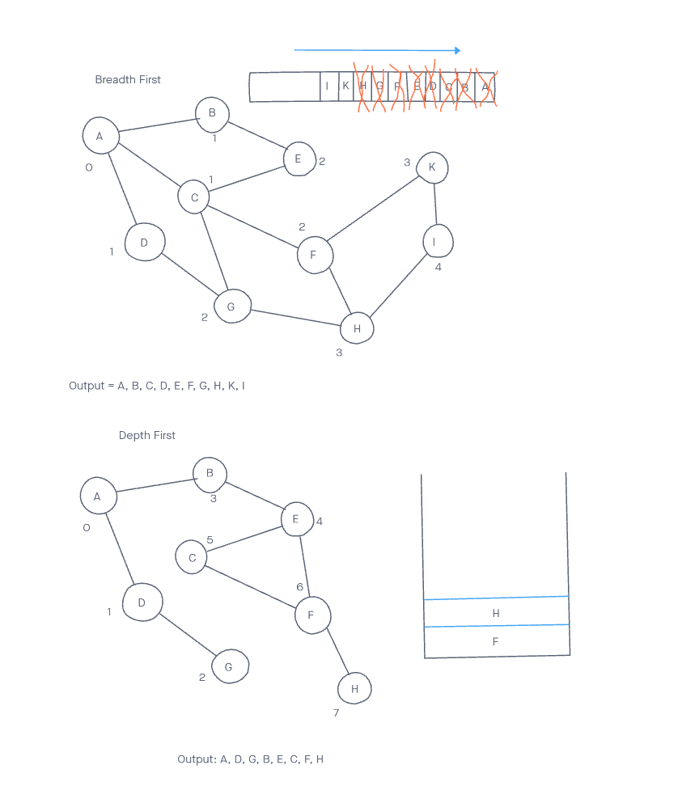

# Graphs

Implement a breadth-first traversal on a graph.

## Challenge

Extend graph object with a breadth-first traversal method that accepts a starting node. Without utilizing any of the built-in methods available to your language, return a collection of nodes in the order they were visited. Display the collection

## Approach & Efficiency

- Wrote `breadthFirst` method
- Wrote tests for method
- Tested for functionality

## API

Existing methods:

- `addNode()`
- `addEdge()`
- `getNodes()`
- `getNeighbors()`
- `size()`

Added:

- `breadthFirst()`

---

- `addNode(value)` - takes in a value, creates and adds a node with that value to the graph

-`addEdge(startVertex, endVertex, weight)` - takes in a start vertex, an end vertex and a weight, then it creates an edge from the start to the end vertex with the designated weight (or a weight of 0 if not specified)

-`getNodes()` - returns an array of all node values in the graph

-`getNeighbors(vertex)` - takes in a vertex and returns a list of all of the vertex's neighbors

-`size()` - returns the number of nodes contained in the graph

- `breadthFirst(vertex)` - takes in a vertex(node) and returns an array of the values of all vertices, beginning with the supplied vertex, in a breadth-first traversal order.

## Solution

[code](./graph.js)

