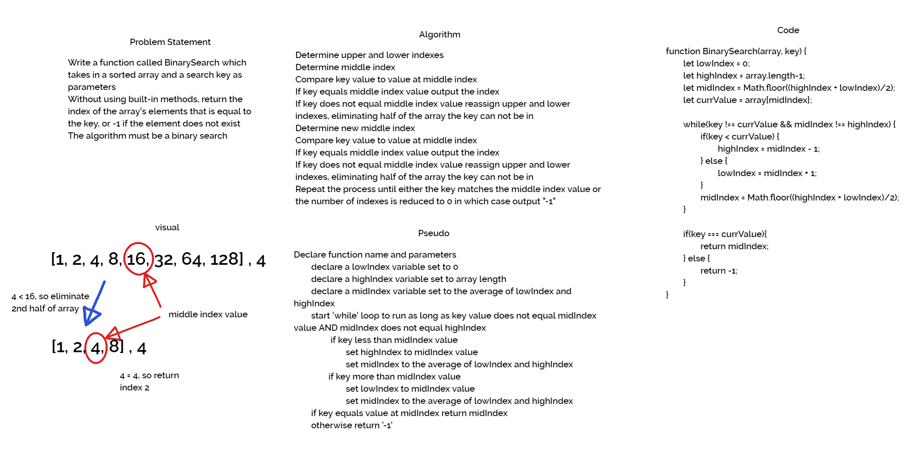

# Array Binary Search

Create a function that takes in an array and a value as arguments and returns that array with the supplied value in the middle index.

## Challenge

The challenge is to write a function which takes an array and a value as arguments, and without using any built-in/prototype methods available in JavaScript, returns an array of the elements in the same order with the supplied value inserted in the middle index.

## Approach & Efficiency

The approach I took was to create an empty array and find the middle index of the supplied array. Next, I *push*ed the individual elements into that array as I iterated through the first half of the original array utilizing a *'for loop'*. Once the loop is complete, the supplied value is *push*ed into the array and then I iterated through the second half of the original array utilizing another *'for loop'* and pushing the elements into the array. Finally, I return the new array.

## Solution
[array-binary-search](array-binary-search.js)

