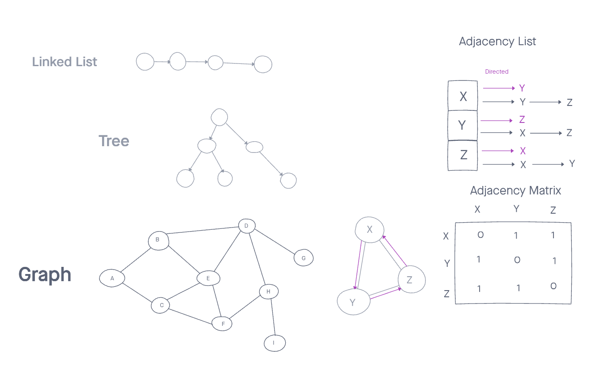

# Graphs

Implement your own Graph.

## Challenge

The graph should be represented as an adjacency list, and should include the following methods:

- AddNode()
  - Adds a new node to the graph
  - Takes in the value of that node
  - Returns the added node
- AddEdge()
  - Adds a new edge between two nodes in the graph
  - Include the ability to have a “weight”
  - Takes in the two nodes to be connected by the edge
  - Both nodes should already be in the Graph
- GetNodes()
  - Returns all of the nodes in the graph as a collection (set, list, or similar)
- GetNeighbors()
  - Returns a collection of edges connected to the given node
  - Takes in a given node
  - Include the weight of the connection in the returned collection
- Size()
  - Returns the total number of nodes in the graph

## Approach & Efficiency

- Wrote classes for Vertex, Edge and Graph
- Wrote all required methods
- Wrote test suite
- Tested for functionality

## API

`addNode()`
`addEdge()`
`getNodes()`
`getNeighbors()`
`size()`

- `addNode(value)` - takes in a value, creates and adds a node with that value to the graph

-`addEdge(startVertex, endVertex, weight)` - takes in a start vertex, an end vertex and a weight, then it creates an edge from the start to the end vertex with the designated weight (or a weight of 0 if not specified)

-`getNodes()` - returns an array of all node values in the graph

-`getNeighbors(vertex)` - takes in a vertex and returns a list of all of the vertex's neighbors

-`size()` - returns the number of nodes contained in the graph

## Solution

[code](./graph.js)

