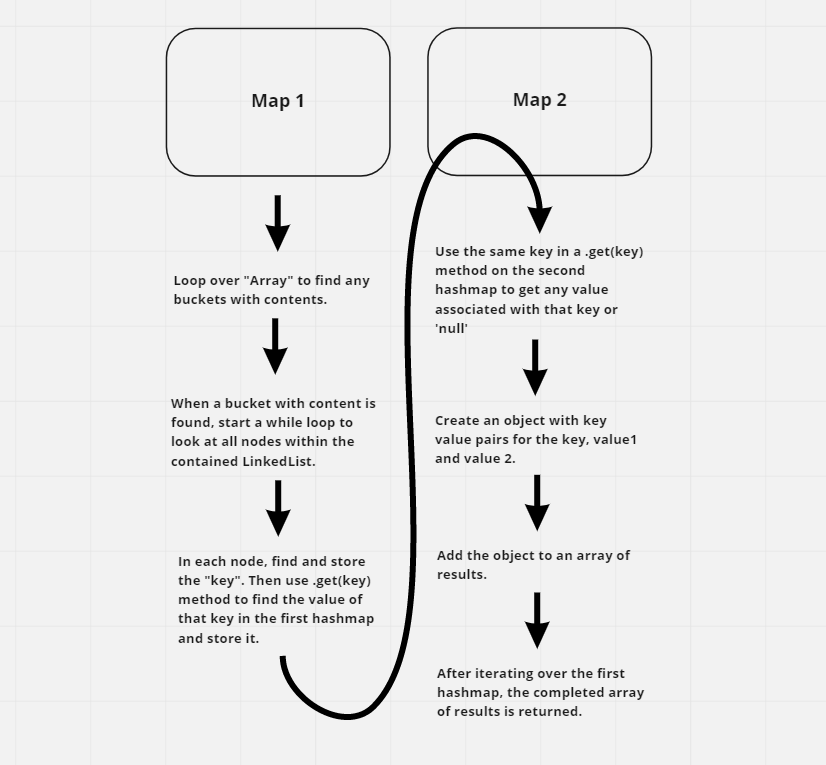

# Hashmap LEFT JOIN

Implement a simplified LEFT JOIN for 2 Hashmaps.

## Challenge

- Write a function that LEFT JOINs two hashmaps into a single data structure.
- The first parameter is a hashmap that has word strings as keys, and a synonym of the key as values.
- The second parameter is a hashmap that has word strings as keys, and antonyms of the key as values.
- Combine the key and corresponding values (if they exist) into a new data structure according to LEFT JOIN logic.
- LEFT JOIN means all the values in the first hashmap are returned, and if values exist in the “right” hashmap, they are appended to the result row. If no values exist in the right hashmap, then some flavor of `NULL` should be appended to the result row.
- The returned data structure that holds the results is up to you. It doesn’t need to exactly match the output below, so long as it achieves the LEFT JOIN logic.
- Avoid utilizing any of the library methods available to your language.

## Approach & Efficiency

- Created two hashmaps for testing purposes
- Wrote function to loop over first map looking for buckets with content
- Modified function to find the "key" in the head of the LinkedList located in a bucket
- Added code to find values for the key from both maps and create an object out of them
- Added a results array to hold the ouput and deliver it via return
- Wrote tests for the function
- After testing recognized a vulnerablility in the function when there was more than one node on the LinkedList within a bucket
- Refactored code to address vulnerability
- Refined tests and tested solution again

## Solution

[Solution Code](./left-join.js)

