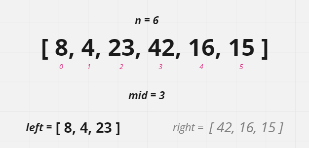
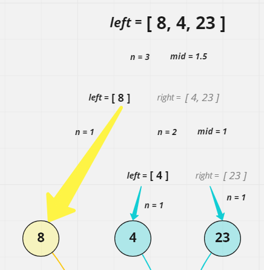
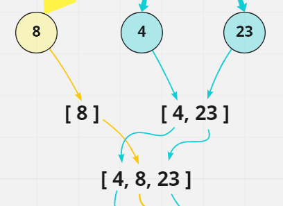
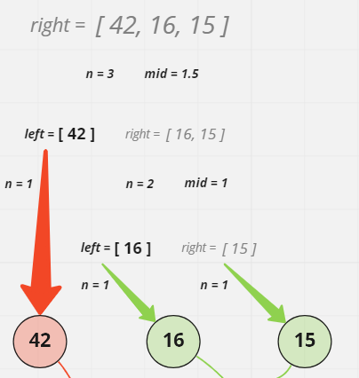
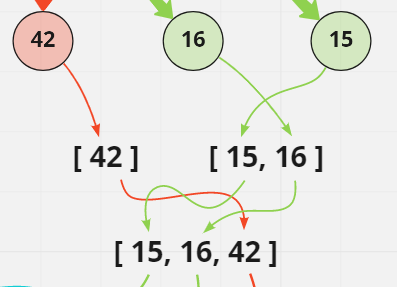
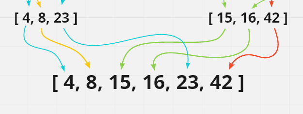

# Merge Sort
---
Insertion sort is an array sorting algorithm which recursively splits the original array in half until each resulting half of a split array has one index or no indexes. At this point, each division is *'sorted'* by definition because an array of 1 element is always in order.

Next the singleton arrays are recombined in the same manner as they were separated, with one key difference. The values of the current two arrays being recombined are iterated over and the lowest value is placed first in the next larger array. In this manner, as the recombining arrays grow from 1s to 2s to 4s to 8s in length, the next larger resulting arrays are always in sorted order.

This continues until all of the smaller arrays have been recombined into an array of the same length as the original with its elements now sorted in ascending order.

## Pseudocode
---
```
ALGORITHM Mergesort(arr)
  DECLARE n <-- arr.length

  if n > 1
    DECLARE mid <-- n/2
    DECLARE left <-- arr[0...mid]
    DECLARE right <-- arr[mid...n]

    Mergesort(left)

    Mergesort(right)

    Merge(left, right, arr)

ALGORITHM Merge(left, right, arr)
  DECLARE i <-- 0
  DECLARE j <-- 0
  DECLARE k <-- 0

  while i < left.length && j < right.length
    if left[i] <= right[j]
      arr[k] <-- left[i]
      i <-- i + 1
    else
      arr[k] <-- right[j]
      j <-- j + 1

    k <-- k + 1

  if i = left.length
    set remaining entries in arr to remaining values in right
  else
    set remaining entries in arr to remaining values in left
```

## Trace
---
#### Sample Array: [8, 4, 23, 42, 16, 15]

### Step One:



First, the array is split in half as evenly as possible. `mergeSort()` is then called for the left sub-array.

### Step Two:



Next, the left sub-array is split as evenly possible.
The result in this case is a left sub-array with one value and a right sub-array with 2 values. `mergeSort()` is then called for the sub-array containing two values resulting in 2 sub-arrays with one value each. The entire left side of the original array has been reduced.

### Step Three:



Now the sub-divided arrays are re-merged in sorted order due to logic that compares the values of the specified indexes of contributing arrays. This continues until the left half of the original array is reassembled in sorted order.

### Step Four:



`mergeSort()` is then called for the right sub-array. The sub-array is split as evenly possible.
The result in this case is a left sub-array with one value and a right sub-array with 2 values. `mergeSort()` is then called for the sub-array containing two values resulting in 2 sub-arrays with one value each. The entire right side of the original array has been reduced.

### Step Five:



Now the sub-divided arrays are re-merged in sorted order using the same logic that was used for the left side. This continues until the right half of the original array is reassembled in sorted order.

### Step Six:



Finally, the two sorted halves are merged back into the original array which has now been completely sorted.

- **[ 4, 8, 15, 16, 23, 42 ]**


## Big O's
---
- The Time Complexity for an insertion sort is: **O(nLogn)**
- The Space Complexity for an insertion sort is: **O(n)**

## The Code
---
The complete code for this sort function can be found [here](./merge-sort.js)
