# Quick Sort
---
Quick sort is an array sorting algorithm which partitions the original array based on an assigned 'pivot'. The partion arrays contain values which are less than the pivot value and more than the pivot value. The 'sub-arrays' are then recursively sorted, either swapping elements in place or further partioning the sections of the array. Once these recursive sorts are complete, the array is completely sorted.

## Pseudocode
---
```
ALGORITHM QuickSort(arr, left, right)
  if left < right
    DEFINE position <-- Partition(arr, left, right)

    QuickSort(arr, left, position - 1)

    QuickSort(arr, position + 1, right)

ALGORITHM Partition(arr, left, right)
  DEFINE pivot <-- arr[right]
  DEFINE low <-- left - 1

  for i <- left to right do
    if arr[i] <= pivot
      low++
      Swap(arr, i, low)

  Swap(arr, right, low + 1)

  return low + 1

ALGORITHM Swap(arr, i, low)
  DEFINE temp;
  temp <-- arr[i]
  arr[i] <-- arr[low]
  arr[low] <-- temp
```

## Trace
---
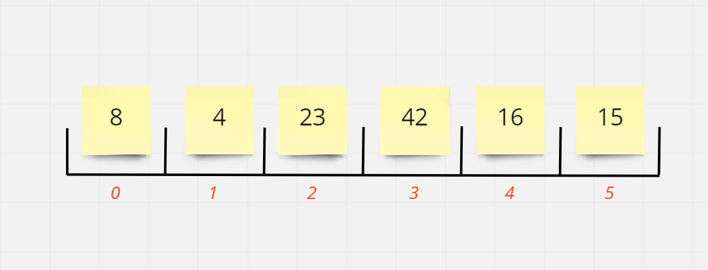

### Step One:

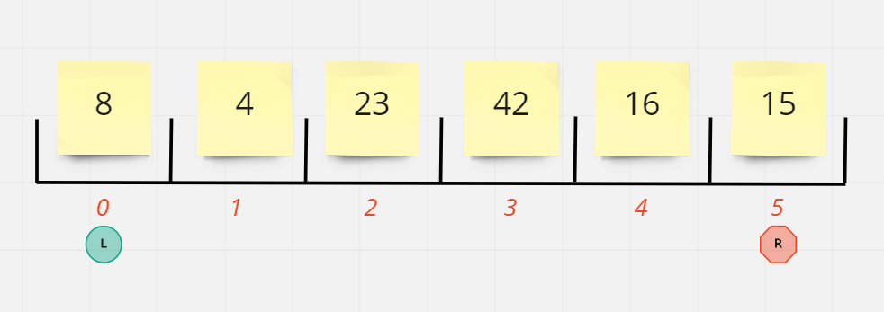

A left (0) and a right (array.length-1(5)) are assigned. `Left` is less than `right`, so `quickSort()` proceeds to call `partition()`.

### Step Two:

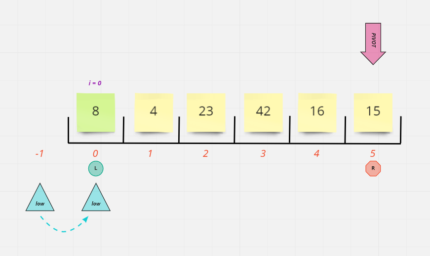

Within partition, a pivot value of `15` is assigned, a `low` variable is assigned to `left` - 1, and a for loop is begun with `i` equal to `left` (0) and and `low` equal to -1. Because 8, the value of arr[i] is less than the pivot value of 15, the inner if loop activates and increments `low` to 0 and then swaps the position of arr[low] and arr[i], which in this case, keeps 8 in the arr[0] position.

### Step Three:

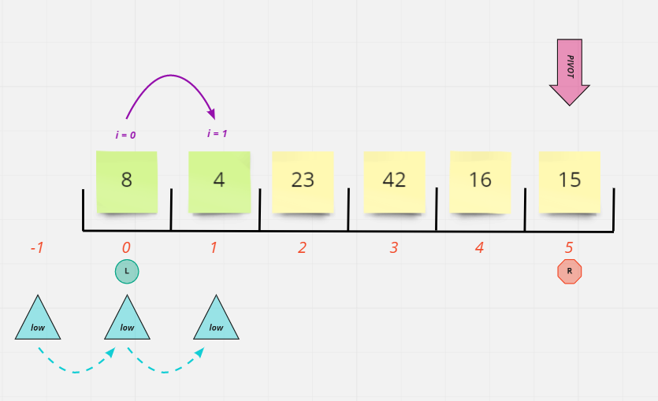

`i` increments to 1. 4 is compared to 15 and is lower. So the if loop fires again, incrementing `low` to 1 and "swapping" the 4 with itself.

### Step Four:

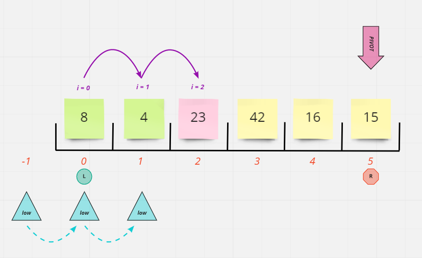

`i` increases to 2. When 23 is compared to the pivot value of 15, it is NOT less and therefore the if loop does nothing. `low` remains with a value of 1.

### Step Five:

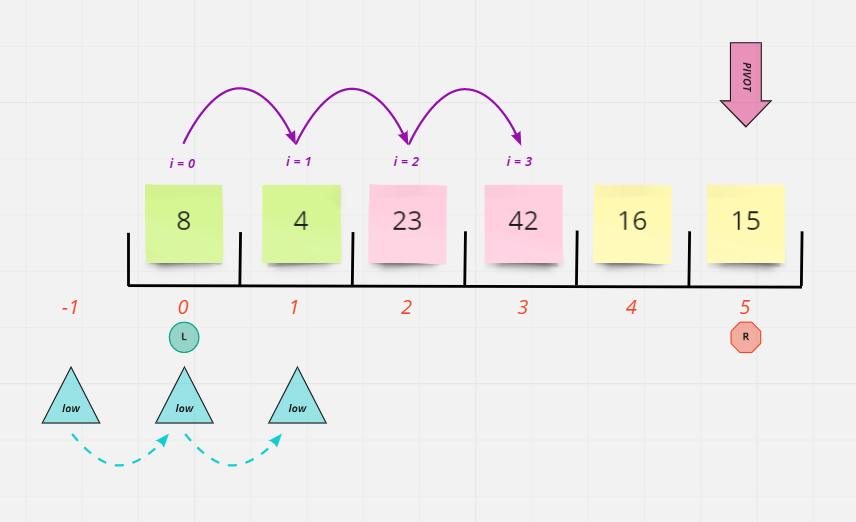

`i` increments to 3. Again, 42 is not less than 15 and the if loop is not activated. `low` is still 1.

### Step Six:

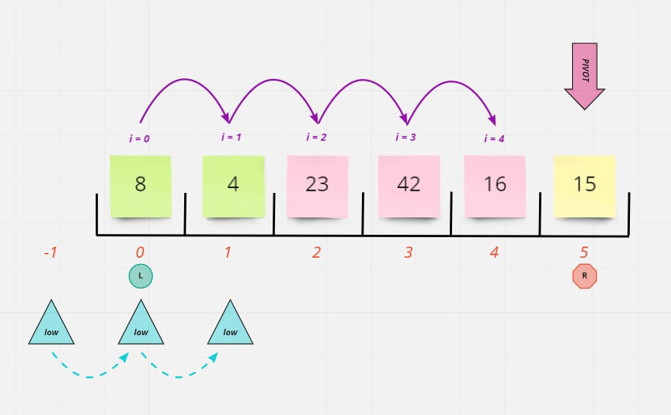

`i` increments to 4. 16 evaluates greater than 15. The if loop does not activate. `low` remains 1.

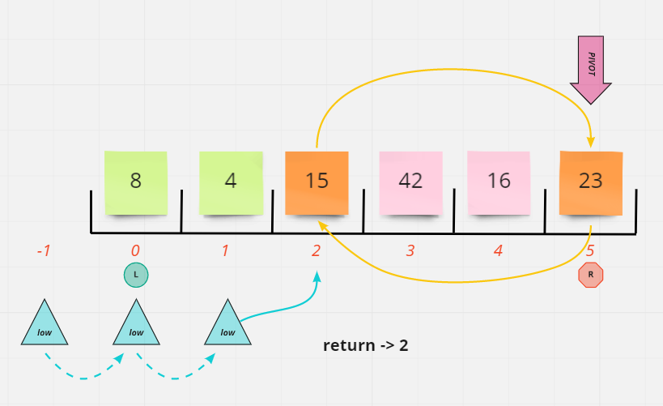

The for loop ends. The values at index `low`+1 (2) and right (5) are now swapped, and `low` + 1 (2) is returned from `partition()` and assigned to the `position` variable in the `quickSort()` function.

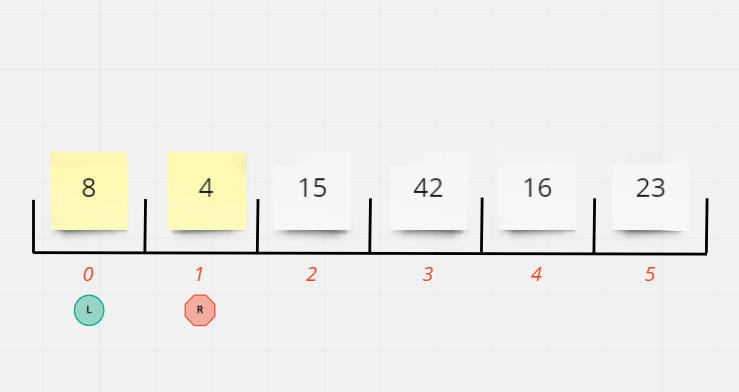

Next the recursive `quickSort()` function is called for the left partition of the array with a left value of 0 and a right value of 1 (`position` - 1).

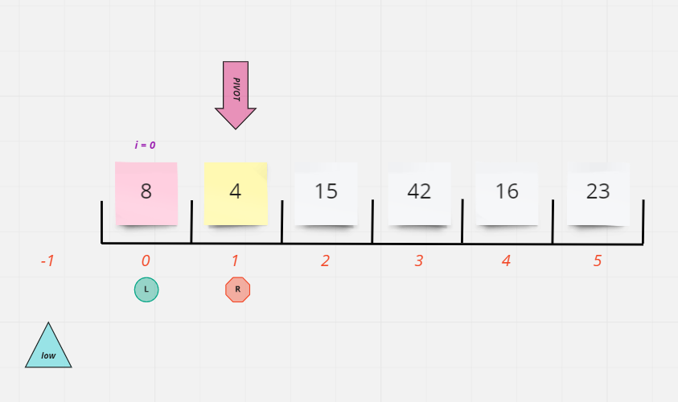

Since `left` is less than `right`, `partition()` is called again. `pivot` is set to 4, `low` is set to -1, and the for loop runs exactly once. Because 8 is not less than 4, `low` is not incremented and then the for loop ends. 

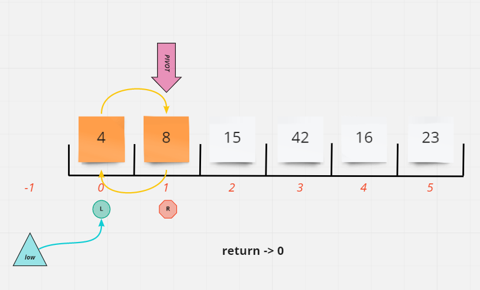

The values at index `low`+1 (0) and right (1) are now swapped, and `low` + 1 (0) is returned from `partition()` and assigned to the `position` variable in the `quickSort()` function.

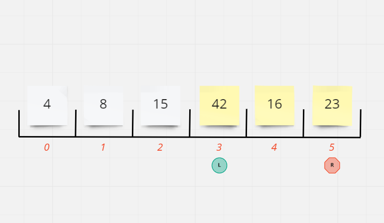

Because `left` is no longer less than `right` this bit of recursion ends and the previous `quickSort()` function picks back up with a `position` value of 2. The second recursive `quickSort()` function is called for the right partition of the array with a left value of 3 (`position` + 1) and a right value of 5 (array.length - 1).

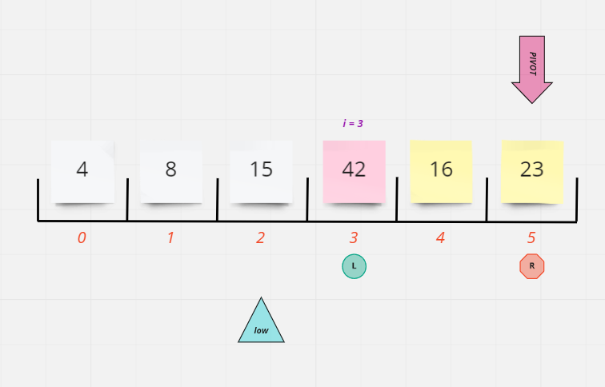

`left` is less than `right`, so `partition()` is called. Within partition, a pivot value of `23` is assigned, a `low` variable is assigned to (`left` - 1), and a for loop is begun with `i` equal to `left` (3) and and `low` equal to 2. Because 42 is not less than 23, the if loop is not activated. `low` retains a value of 2.

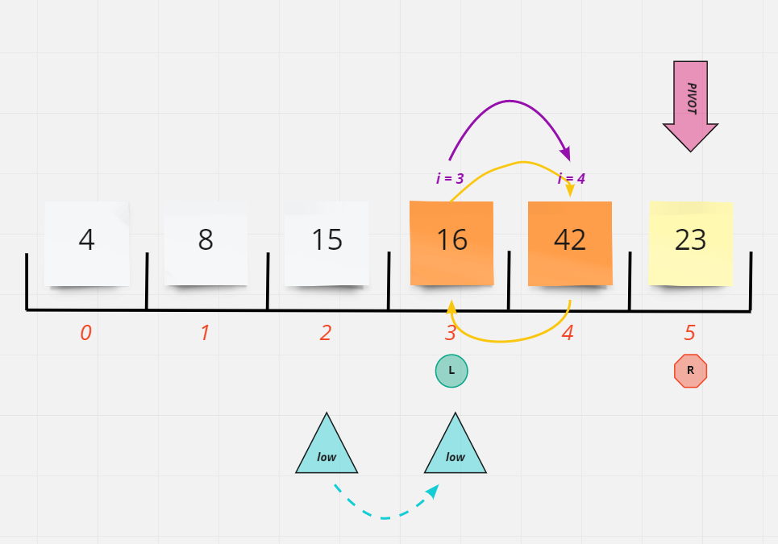

`i` increments to 4. The value of 16 is found to be less than 23 and so the if loop activates. `low` is incremented to 3, and then the values at arr[low] (42) and arr[i] (16) are swapped.

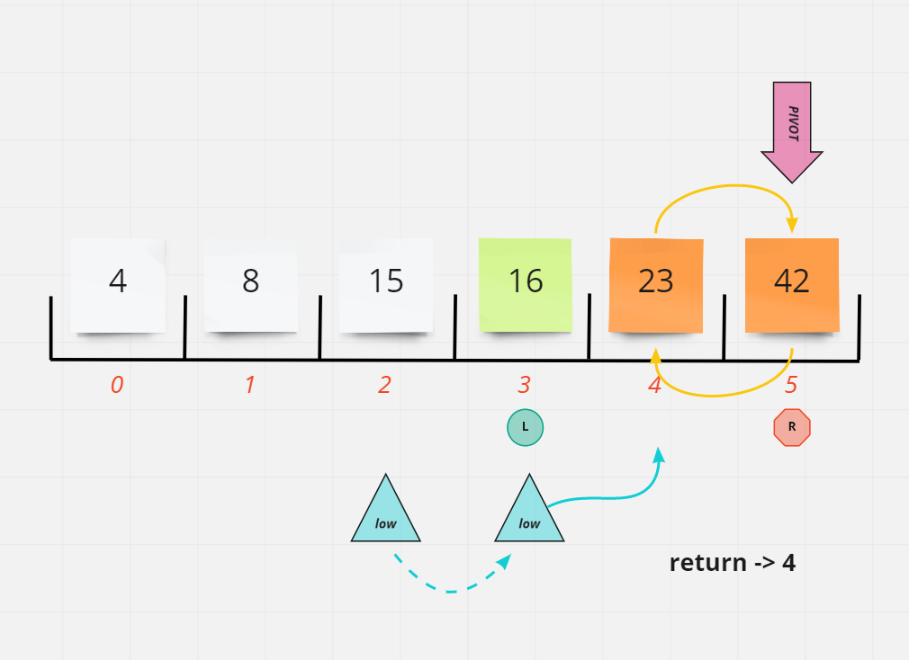

The for loop ends for what will be the last time. The values at right (23) and arr[`low`+1] (42) are swapped. 4 is returned from `partition()`, which will prevent any further recursion because `left` will no longer be less than `right`.

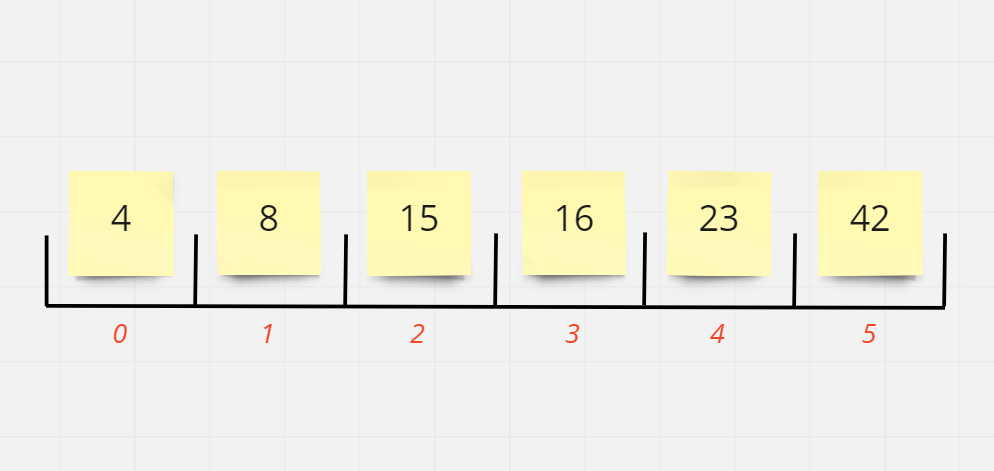

The function completes and the array is now sorted.


## Big O's
---
- The Time Complexity for an insertion sort is: **O(nLogn)**
- The Space Complexity for an insertion sort is: **O(1)**

## The Code
---
The complete code for this sort function can be found [here](./quick-sort.js)
